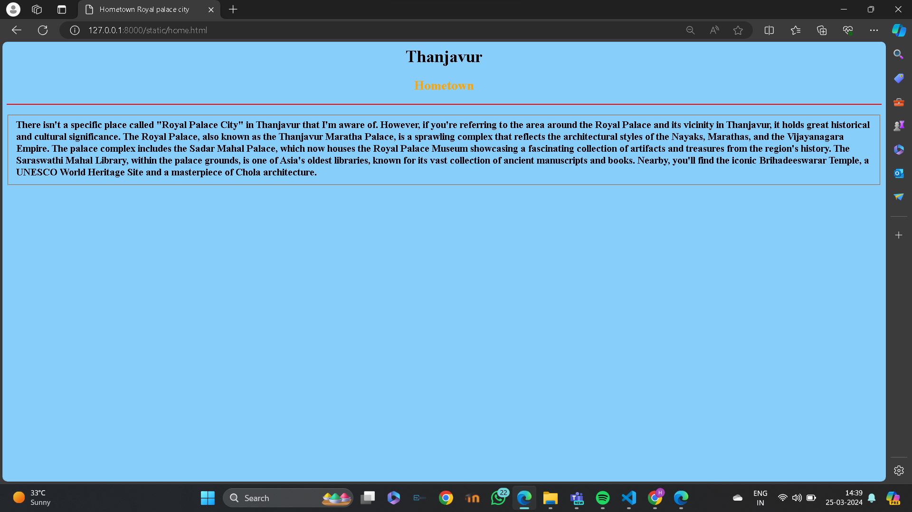
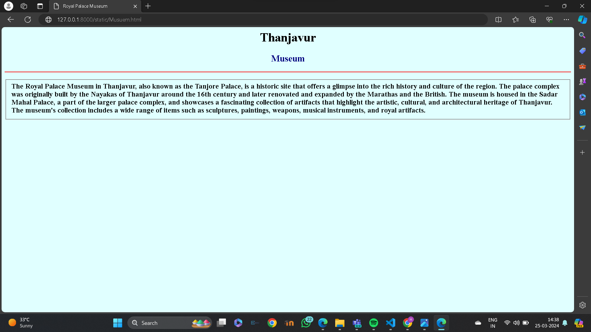
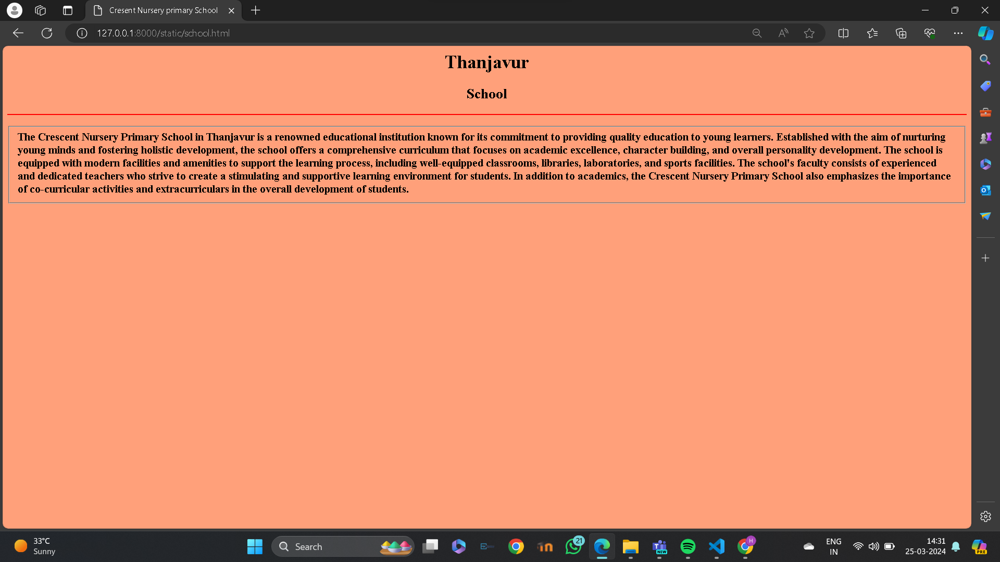

# Ex04 Places Around Me
## Date: 23.3.2024

## AIM
To develop a website to display details about the places around my house.

## DESIGN STEPS

### STEP 1
Create a Django admin interface.

### STEP 2
Download your city map from Google.

### STEP 3
Using ```<map>``` tag name the map.

### STEP 4
Create clickable regions in the image using ```<area>``` tag.

### STEP 5
Write HTML programs for all the regions identified.

### STEP 6
Execute the programs and publish them.

## CODE
```
map.html

<html>
<head>
<title>My city</title>
</head>
<body>
<h1 align="center">
<font color="red"><b>Thanjavur</b></font>
</h1>
<h3 align="center">
<font color="blue"><b>Hariharan A (212223110013)</b></font> 
</h3>
<center>

<map name="MyCity">
<area shape="rect" coords="1150,200,,1250,150" href="home.html" title="My Home Town">
<area shape="rect" coords="550,450,,650,550" href="temple.html" title="Thanjai PeriyaKovil">
<area shape="rect" coords="700,200,,800,150" href="Musuem.html" title="Royal Palace Musuem">
<area shape="rect" coords="660,230,,740,280" href="Palace.html" title="Thanjavur Maratha Palace">
<area shape="rect" coords="1000,200,,1100,100" href="school.html" title="Crescent Nursery and Primary school">
</map>
</center>    
</body>
</html>

home.html

<html>
    <head><title>Hometown Royal palace city</title></head>
    <style>
        *{background-color:lightskyblue;

        }
        h1{
            text-align: center;
            color:black;
        }
        h2{
            text-align: center;
            color: orange;
        }
        
    </style>
    <body >
        <h1>Thanjavur</h1>
        <h2>Hometown</h2>
        <hr color="red">
        <h3><p> <fieldset>
            There isn't a specific place called "Royal Palace City" in Thanjavur that I'm aware of.
             However, if you're referring to the area around the Royal Palace and its vicinity in Thanjavur, it holds great historical and cultural significance. 
             The Royal Palace, also known as the Thanjavur Maratha Palace, is a sprawling complex that reflects the architectural styles of the Nayaks, Marathas, and the Vijayanagara Empire.
             The palace complex includes the Sadar Mahal Palace, which now houses the Royal Palace Museum showcasing a fascinating collection of artifacts and treasures from the region's history. 
             The Saraswathi Mahal Library, within the palace grounds, is one of Asia's oldest libraries, known for its vast collection of ancient manuscripts and books.
             Nearby, you'll find the iconic Brihadeeswarar Temple, a UNESCO World Heritage Site and a masterpiece of Chola architecture.
        </body>
</html>

temple.html

<html>
    <head><title> Thanajavur Temple</title></head>
    <style>
        *{background-color:pink;

        }
        h1{
            text-align: center;
            color:black;
        }
        h2{
            text-align: center;
            color: red;
        }
        
    </style>
    <body >
        <h1>Thanjavur</h1>
        <h2>Temple</h2>
        <hr color="red">
        <h3><p> <fieldset>
        Thanjavur Kovil, also known as the Brihadeeswarar Temple or Peruvudaiyar Kovil, is a masterpiece of Dravidian architecture located in the city of Thanjavur in Tamil Nadu, India.
         Built by the Chola emperor Raja Raja Chola I in the 11th century, it is a UNESCO World Heritage Site and is considered one of the greatest architectural achievements of the Chola dynasty. 
        The temple is dedicated to Lord Shiva and is renowned for its grandeur, architectural excellence, and exquisite sculptures.
        The most striking feature of the Thanjavur Kovil is its towering vimana, or temple tower, which rises to a height of about 66 meters (216 feet) and is capped by a massive monolithic cupola weighing around 80 tons.
        This cupola is believed to have been placed at the top of the vimana using a 6-kilometer long ramp, an engineering feat that showcases the advanced skills of the Chola architects and artisans.
        </body>
</html>

museum.html

<html>
    <head><title> Royal Palace Museum</title></head>
    <style>
        *{background-color:lightcyan;

        }
        h1{
            text-align: center;
            color:black;
        }
        h2{
            text-align: center;
            color: navy;
        }
        
    </style>
    <body >
        <h1>Thanjavur</h1>
        <h2>Museum</h2>
        <hr color="red">
        <h3><p> <fieldset>
        The Royal Palace Museum in Thanjavur, also known as the Tanjore Palace, is a historic site that offers a glimpse into the
        rich history and culture of the region.
         The palace complex was originally built by the Nayakas of Thanjavur around the 16th century and later renovated and expanded by the Marathas and the British.
        The museum is housed in the Sadar Mahal Palace, a part of the larger palace complex, and showcases a fascinating collection of artifacts that highlight the artistic, cultural, and architectural heritage of Thanjavur. 
        The museum's collection includes a wide range of items such as sculptures, paintings, weapons, musical instruments, and royal artifacts.
        </body>
</html>

palace.html


<html>
    <head><title>Maratha Palace</title></head>
    <style>
        *{background-color:violet;

        }
        h1{
            text-align: center;
            color:black;
        }
        h2{
            text-align: center;
            color: Red;
        }
        
    </style>
    <body >
        <h1>Thanjavur</h1>
        <h2>Palace</h2>
        <hr color="red">
        <h3><p> <fieldset>
        The Maratha Palace in Thanjavur, also known as the Nayak Palace, is a historic complex that stands as a testament to the Maratha rule in Thanjavur. 
        Built around the 17th century by the rulers of the Bhonsle dynasty, who were descendants of the Maratha warrior king Shivaji, 
        the palace complex is a blend of Maratha, Nayak, and European architectural styles.
       The Maratha Palace complex is comprised of several buildings, courtyards, and structures, each with its own unique features and significance. 
       The Durbar Hall, or the audience hall, is one of the most impressive structures in the palace complex, with its grand arches, intricate carvings, and majestic pillars. 
       This hall was used for official ceremonies and meetings during the Maratha rule.
       Another notable feature of the Maratha Palace is the Saraswathi Mahal Library, which is one of the oldest libraries in Asia
        
        </body>
</html>

school.html

<html>
    <head><title> Cresent Nursery primary School</title></head>
    <style>
        *{background-color:lightsalmon;

        }
        h1{
            text-align: center;
            color:black;
        }
        h2{
            text-align: center;
            color: orange;
        }
        
    </style>
    <body >
        <h1>Thanjavur</h1>
        <h2>School</h2>
        <hr color="red">
        <h3><p> <fieldset>
            The Crescent Nursery Primary School in Thanjavur is a renowned educational institution known for its commitment to providing quality education to young learners. 
            Established with the aim of nurturing young minds and fostering holistic development, the school offers a comprehensive curriculum that focuses on academic excellence, character building, and overall personality development.
            The school is equipped with modern facilities and amenities to support the learning process, including well-equipped classrooms, libraries, laboratories, and sports facilities. 
           The school's faculty consists of experienced and dedicated teachers who strive to create a stimulating and supportive learning environment for students.
           In addition to academics, the Crescent Nursery Primary School also emphasizes the importance of co-curricular activities and extracurriculars in the overall development of students.
        
        </body>
</html>

```

## OUTPUT










## RESULT
The program for implementing image maps using HTML is executed successfully.
